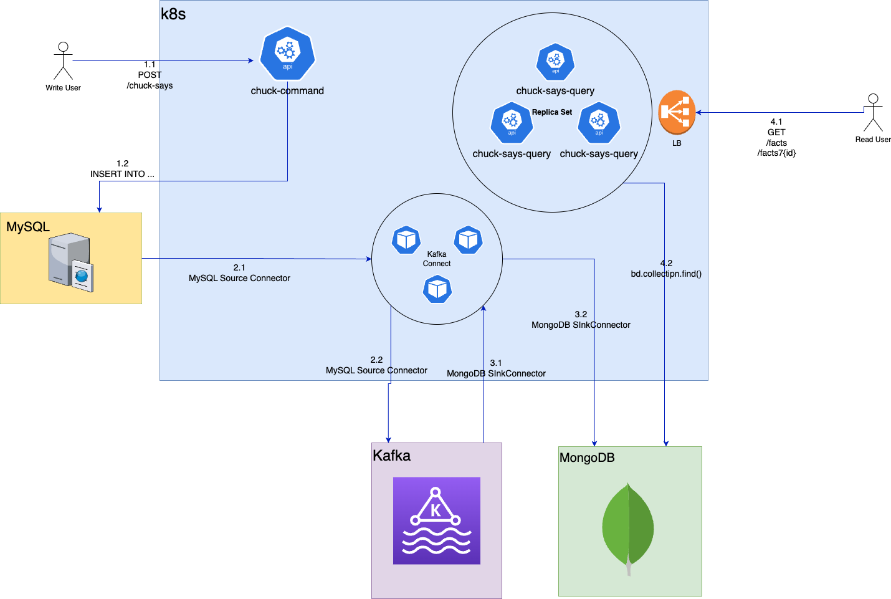

# Arquitectura de Microservicios

### Diagrama de cajas

### Introducción
Existe la necesidad de crear una arquitectura basada en microservicios para cumplir con los requisitos de la aplicación "chuck-says". Esta aplicación tiene un endpoint que genera hechos atribuidos a Chuck Norris y otros dos para consultar dichos hechos. Es crucial diseñar una arquitectura que pueda escalar horizontalmente para garantizar robustez a nuestros clientes.

Las especificaciones de estas APIs se encuentran en **swagger/swagger.yml** y se pueden visualizar de manera interactiva al levantar todos los contenedores con el script `start.sh`.

### Diseño de solución
Para nuestra solución implementaremos el patrón CQRS. Separaremos el datastore de lectura y escritura utilizando MySQL para la escritura, una base de datos relacional que asegura la transaccionalidad al crear los hechos. Para la lectura utilizaremos MongoDB, una base de datos documental conocida por su rápida lectura y escalabilidad horizontal, lo que elimina preocupaciones sobre la cantidad de peticiones.

También utilizaremos el patrón outbox. Este patrón nos permite enviar eventos que informan sobre la creación de un registro, asegurando atomicidad en el envío del evento, es decir, se informa sobre la creación del registro si y solo si el registro se agrego efectivamente en la tabla. En lugar de que la aplicación se comunique directamente con el message broker (en este caso Kafka), los registros se extraen de la tabla utilizando otro servicio independiente, en nuestro caso **Kafka Connect**. Esto permite separar responsabilidades, donde la aplicación solo persiste en la base de datos y Connect se encarga de la replicación.En nuestro caso, configuramos dos conectores: uno de origen para leer desde MySQL y otro de destino para escribir en MongoDB. 

Nuestra arquitectura consiste en tres partes: la API de escritura a la BD, la replicación entre BD y MongoDB, y la API de lectura. Todos estos componentes son angnósticos entre sí y pueden evolucionar de manera independiente. La mayoría de los componentes son escalables horizontalmente, excepto MySQL; las APIs y Connect al desplegarse en Kubernetes adquieren esta capacidad y MongoDB también es escalable.

La principal desventaja de este diseño es que puede haber un desfase entre los datos en la base de datos y los datos en MongoDB, lo que implica consistencia eventual. Esto es un compromiso esperado para garantizar disponibilidad y particionamiento de datos, mejorando la eficiencia de lectura.
